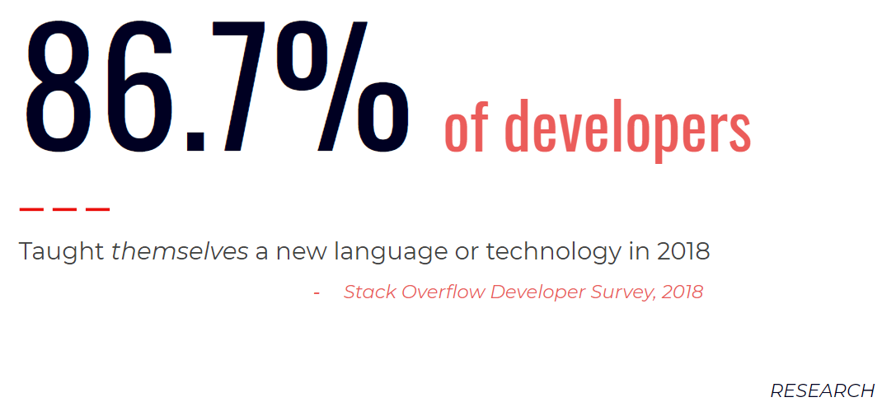

# Dev Lab

DevLab is a crowd-sourced platform for learning how to code. As developers, we are often bombarded with an overwhelming flood of resources. DevLab seeks to wade through the flood by providing a robust, user-driven tool to pool the best resources!

* This is a Full-Stack Application powered by Javascript, jQuery, SQL, and node.js. It follows a MVC framework with a RESTful architecture 

# Applied Research and Motivations



Developers and engineers are constantly seeking and self-learning new technologies. DevLab seeks to provide them the best peer-reviewed content by enabling them to upload, rate, and save the most helpful and effective material.


## Getting Started

Follow the deployed project link below to utilize the application.

### Deployed Project Link
<!-- make a link to the deployed site -->
 
[Dev Lab](devlab.herokuapp.com)


### Image Preview of DevLab
<!-- take a picture of the image and add it into the readme  -->
[](skeeis.github.io/Pet-Package/)

## Prerequisites

The page can be run from any browser, preferably on Google Chrome!

## Technologies Used

### Frontend Technologies
* **HTML5**
* **CSS3** - Grid and FlexBox
* **Javascript** - the primary scripting logic enabling our application
* **jQuery** - the robust scripting library for Javascript
* [**UIkit**](https://getuikit.com/) - the open-source web styling framework used for structural design, animation, and filter-sorting
* [**Bideo.js**](https://github.com/rishabhp/bideo.js?utm_source=hashnode.com) - responsive video implementation
* [**Moment.js**](momentjs.com) - datetime manipulation
* Paint 3D - icon and image editing

### Backend Technologies and Critical Node Packages

#### Node.js - versatile Javascript runtime 
* **Express.js** - backend server routing framework
* **MySQL2** - server-side relational database usage
* **Sequelize.js** - object-relational mapping (ORM) for SQL
* **Passport.js** - local-strategy login authentication
* **Bcrypt** - two-sided hash encrypting
* **Body Parser, Path** - middleware technology for JSON and expediting filepaths

# Design History 

### Initial Mockups and Wireframe

We initially designed a rough wireframe outlining the core functionality of the application. The user would be able to log-in and parse through a variety of useful material and save the most relevant.


*Design Stage One*

### Final Design Comparisons

The application shifted through a rigorous design shift in which a splash page was rendered to comfortably welcome the user to the website.


*Splash Page - Design Stage Two and Three*

# Code Snippets
<!-- put snippets of code inside ``` ``` so it will look like code -->
<!-- if you want to put blockquotes use a > -->

Here, we queried Petfinder’s API with a jQuery AJAX call and created unique conditional statements to check whether certain pet characteristics existed for each pet. Since Petfinder’s API has different requirements and different outputs for each query, we had to make sure that each parameter existed before we proceeded. 


Dynamic generation of HTML elements via jQuery is an extremely powerful tool to instantaneously adjust the webpage to the user's interaction with the interface. Here, we establish a simple, clean iframe in the HTML waiting to be rendered. Without a source, Google Maps doesn’t generate.
Then, we embed a "data-location" attribute within each pet thumbnail on the page. From there, we push the address *on click* of the thumbnail to dynamically generate a particular source attribute of a Google Maps iFrame HTML element so that we can query appropriately and populate the location of the animal.


We also implemented dynamic CSS styling upon creation of new HTML elements. 

```


```


# Learning Points and Future Goals
<!-- Learning points where you would write what you thought was helpful -->
* Firebase is extremely useful for long-term cloud storage of user data
* *Additional Learning Points to Come*

## Core Developers

* **Andrew Meyer** - [GitHub](https://github.com/andypants152)
* **Brian Qian** - [GitHub](https://github.com/brianq0)
* **Sajeel Malik** - [GitHub](https://github.com/sajeelmalik)
* **Shuhan Laura Lee** - [GitHub](https://github.com/lalatw)

### Task Breakdown

| Task                                                                     | Lead                        |
|--------------------------------------------------------------------------|-----------------------------|
| Design, Research, Logic and Execution                                    | Andrew, Brian, Sajeel, Laura |
| *SQL and Sequelize*  Team                                                 | Laura, Brian                |
| *Authentication* and Passport Execution                                         | Andrew                      |
| *Graphics/Front End* Direction                                             | Sajeel                       |
| *Client-side* Javascript and jQuery                                         | Brian, Sajeel                      |
| *Routing and Model* Construction                                             | Laura, Andrew, Brian                |

## License

This project is licensed under the MIT License - see the [LICENSE.md](LICENSE.md) file for details